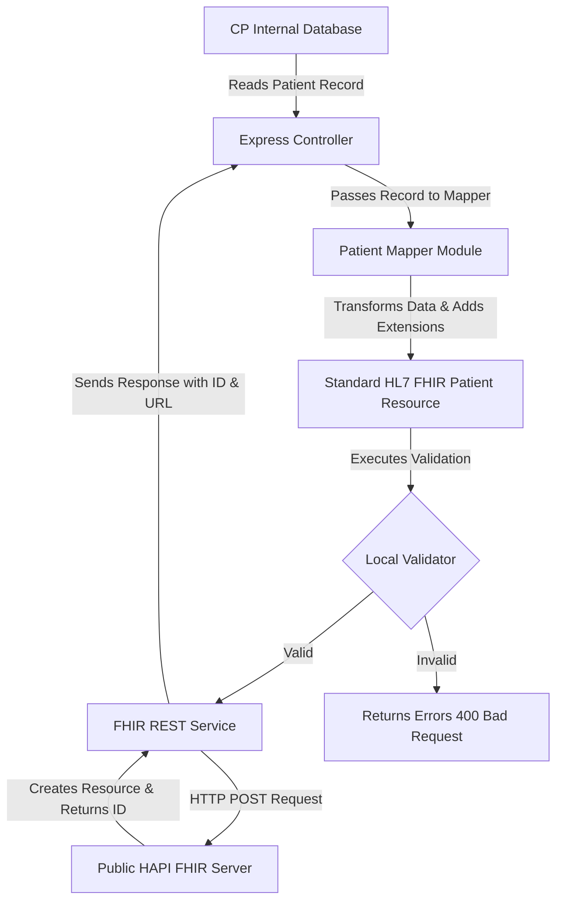

# Integration Architecture

This document describes the architectural flow and design choices behind CP's HL7 FHIR R4 Integration Proof of Concept.

## Architecture Flow

The data flow from internal storage to a standardized external API is structured as follows:

1. **Internal Database Layer**: Stores patient demographics, records, and metadata optimized for performance, transactions, and user experiences.
2. **Mapper Layer (`patientMapper.ts`)**: Decoupled module that maps internal formats, formats strings/dates, translates status codes (like numeric genders), and attaches workflow-specific extensions.
3. **FHIR Resource Layer**: Validated JSON payload conforming to HL7 FHIR R4 standard.
4. **FHIR REST Service (`fhirService.ts`)**: Interacts with local validations and pushes to external servers or consumes FHIR resources from standard providers.

---

## Technical Design Decisions

### 1. Why the Internal Database is NOT Replaced by FHIR
* **Operational Efficiency**: Relational or document databases optimized for application-specific screens perform significantly faster for native workflows compared to native FHIR servers (which require complex document parsing, nesting, and indexing).
* **Development Simplicity**: Storing data in flat structures reduces query complexity. A native FHIR database requires complex queries to combine resources (e.g. joining `Patient`, `AllergyIntolerance`, and `Encounter` resources).
* **Control & Customization**: Internal database structures allow rapid modifications, validation rules, and indexes without waiting for revisions to complex healthcare standards.

### 2. Why Mapping is Required
* **Interoperability**: Healthcare systems, pharmacies, insurances, and government bodies communicate via standardized protocols like HL7 FHIR R4. Mapping enables CP to interface with these ecosystems seamlessly.
* **Format Translation**: Converts custom types (e.g. numeric genders `1` or `2`, custom string formats for HNO, and unformatted inputs) into globally recognized clinical standards.
* **Separation of Concerns**: Changes to the internal schema do not break integrations. Developers only update the mapper translation mapping instead of coordinate-wide database refactoring.
